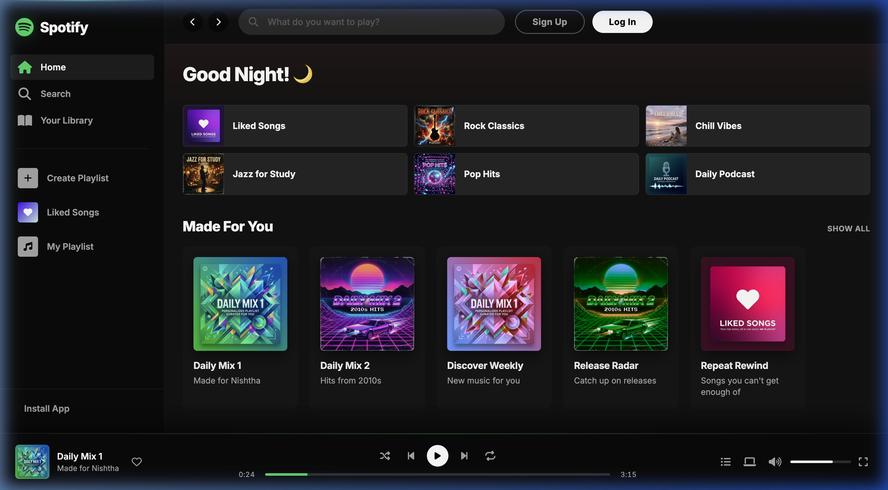
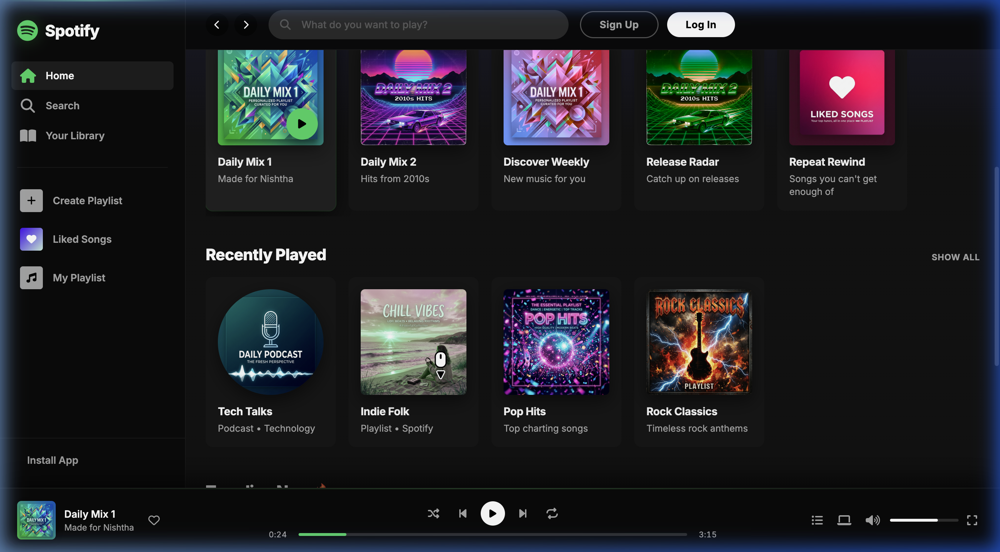

# 🎵 Spotify Web Player Clone

<div align="center">



<br/>

[](https://spotify-clone-liart-sigma.vercel.app)
[](https://developer.mozilla.org/en-US/docs/Web/HTML)
[](https://developer.mozilla.org/en-US/docs/Web/CSS)
[](https://developer.mozilla.org/en-US/docs/Web/JavaScript)

<p align="center">
  A <strong>responsive, interactive clone</strong> of the Spotify Web Player — built with pure HTML, CSS, and Vanilla JavaScript. No frameworks. No dependencies. Just clean, modern front-end engineering.
</p>

</div>

---

## ✨ Features

### 🎛️ Fully Functional Music Player
- **Play / Pause / Skip** — forward and backward track navigation
- **Interactive Progress Bar** — drag to seek anywhere in the track
- **Volume Control** — interactive slider with mute/unmute support
- **Shuffle, Repeat & Like** — toggleable with real-time visual feedback

### 🎨 Premium UI Design
- Dark-themed interface matching Spotify's aesthetic
- **Glassmorphism** cards with backdrop blur
- Smooth **micro-animations** and dynamic gradient backgrounds
- AI-generated, high-quality album art for each track

### ⚡ Dynamic & Interactive
- **Intelligent Greeting** — "Good Morning / Evening / Night" based on local time
- **Live Search Filtering** — filter playlist cards in real time as you type
- **Dynamic Track Loading** — clicking any card updates the player with cover art, title, and artist

### ⌨️ Keyboard Shortcuts

| Key | Action |
|-----|--------|
| `Space` | Play / Pause |
| `←` / `→` | Seek backward / forward |
| `↑` / `↓` | Increase / Decrease volume |
| `M` | Mute / Unmute |
| `N` / `P` | Next / Previous track |

### 📱 Fully Responsive
Adapts beautifully from desktop to tablet to mobile screen sizes.

---

## 🛠️ Tech Stack

| Technology | Purpose |
|---|---|
| **HTML5** | Semantic layout and page structure |
| **CSS3** | Flexbox, Grid, custom properties, keyframe animations, backdrop filters |
| **Vanilla JavaScript (ES6+)** | DOM manipulation, event handling, state management, interval timers |
| **Font Awesome** | Scalable vector icons throughout the UI |
| **Google Fonts (Inter)** | Modern, clean typography |

---

## 📸 Screenshots

### 🏠 Home Dashboard

*Sleek dark-themed dashboard with dynamic greeting, quick-play cards, and curated playlists.*

### 📚 Music Library View

*Scrollable list view with high-quality AI-generated cover art and glassmorphism UI elements.*

---

## 🚀 Run Locally

No build tools required — just open and go!

```bash
# 1. Clone the repository
git clone https://github.com/nishtha-agarwal-211/Spotify-Clone.git

# 2. Navigate into the project
cd Spotify-Clone

# 3. Open in browser
open index.html
```

> 💡 **Tip:** For the best experience, use the [Live Server](https://marketplace.visualstudio.com/items?itemName=ritwickdey.LiveServer) extension in VS Code.

---

## 📁 Project Structure

```
Spotify-Clone/
├── index.html       # Main HTML layout
├── style.css        # All styles, animations & responsive design
├── script.js        # Core JavaScript logic & interactivity
├── image/           # Album art and screenshots
└── README.md        # Project documentation
```

---

## 🌐 Live Demo

**[👉 Click here to view the live app](https://spotify-clone-liart-sigma.vercel.app)**

Deployed via **Vercel** — fast, free, and globally distributed.

---

<div align="center">
  <sub>⚠️ <em>This is a front-end UI clone built for educational purposes only. Not affiliated with or endorsed by Spotify.</em></sub>
  <br/><br/>
  <sub>Made with ❤️ by <a href="https://github.com/nishtha-agarwal-211">Nishtha Agarwal</a></sub>
</div>
